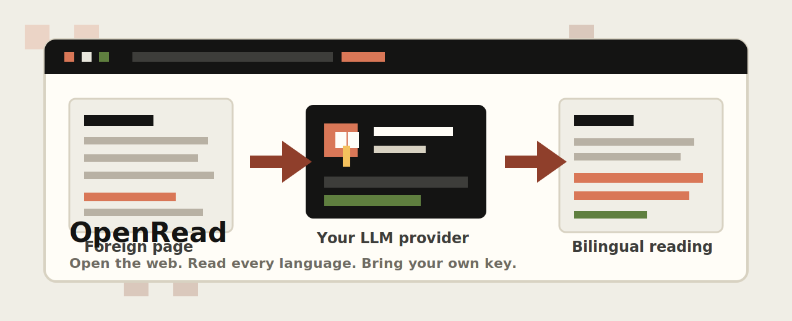

# OpenRead

OpenRead 是一个开源浏览器插件，让阅读外语网页更无痛。它在原网页内进行双语翻译，尽量保留原始上下文，并允许你使用自己的 OpenAI-compatible LLM provider，而不是绑定某个内置订阅套餐。

[English README](README.md)

<p align="center">
  
</p>

<p align="center">
  <strong>打开网络，读懂每一种语言。使用你自己的 key。</strong>
</p>

<p align="center">
  <a href="README.md">English</a>
  ·
  <a href="docs/site-rules-and-agent-tools.md">Site Rules</a>
  ·
  <a href="docs/architecture.md">架构</a>
  ·
  <a href="docs/store-listing.md">商店文案草稿</a>
</p>

<p align="center">
  
  
  
  
</p>

## OpenRead 是什么？

OpenRead 是一个 Chrome MV3 扩展，面向需要认真阅读外语网页的人。它适合文章、文档、研究资料、技术博客、GitHub README、Substack 文章，以及其他需要保留原始页面结构和上下文的长内容页面。

项目目前仍处于早期开发者模式阶段。核心阅读链路已经可用，但复杂页面仍可能出现 DOM 保真问题、间距不自然、漏翻，或者需要针对具体网站继续优化。

## 为什么是 BYOK？

OpenRead 坚持 bring-your-own-key：

- 你配置自己的 OpenAI-compatible `/chat/completions` provider。
- 你可以选择模型、endpoint、目标语言和 prompt。
- 翻译请求直接发送到你配置的 provider，不经过 OpenRead 自己的订阅服务。
- 插件保持可检查、可修改，也更适合个人阅读工作流。

## 功能

- 从 popup 触发网页内翻译。
- 支持原文、仅译文、双语三种显示模式。
- 使用 `IntersectionObserver` 做懒翻译。
- 每次只发送一个 sanitized DOM fragment，不一次性发送整页 HTML。
- 支持多个 OpenAI-compatible provider profiles：Base URL、API key、模型、目标语言、system prompt、user prompt。
- 每个页面翻译运行时可从 popup 选择 provider。
- 本地翻译缓存、队列、重试和超时处理。
- 浏览器原生右键划词翻译，结果显示在可拖动、可固定的浮窗中。
- 可选的输入框三击空格翻译，支持 text input 和 textarea。
- 可配置位置的进度 chip，包含百分比进度和完成动画。
- 扩展 UI 支持 10 种界面语言。
- 设置页支持左侧导航、自动保存、Provider 测试反馈，以及可搜索的已保存 Site Rules 浏览页。
- 基于 JSON Site Rules 的页面翻译区域规则：popup 显示当前页规则状态，支持手动多选翻译区域、载入已保存规则；无规则时继续使用通用翻译逻辑。

## 工作原理

OpenRead 尽量让翻译结果留在原始页面结构里：

1. content script 从当前网页收集可翻译文本块。
2. 如果当前页面命中已保存的 Site Rule，则由规则决定翻译边界。
3. 像 GitHub README 这种大容器只作为边界；内部仍按段落、列表项、标题、引用等普通粒度翻译。
4. 每个 sanitized fragment 通过你配置的 provider 翻译。
5. 翻译结果插回原始 DOM 单元，尽量保留阅读节奏和链接结构。

通用翻译和基于规则的翻译共享 provider 调用、缓存、prompt 渲染、停止清理和富文本渲染流程。

## 从 GitHub Release 安装

GitHub Release 构建包是早期开发者模式包，不是 Chrome Web Store 的一键安装。

1. 下载 release zip，例如 `openread-chrome-mv3-v0.2.0.zip`。
2. 在本地解压。
3. 打开 `chrome://extensions`。
4. 启用 Developer mode / 开发者模式。
5. 点击 Load unpacked / 加载已解压的扩展程序。
6. 选择解压后的扩展目录。

面向普通用户的正式分发渠道会是审核后的 Chrome Web Store。

## 配置 Provider

打开扩展设置页，配置：

- Provider 名称
- Base URL，例如 `https://api.openai.com/v1`
- API Key
- 模型，例如 `gpt-4o-mini`
- 目标语言
- 界面语言
- 进度 chip 位置
- System prompt
- User prompt

Prompt variables:

- `{{targetLanguage}}`
- `{{sourceHtml}}`
- `{{sourceText}}`

## Site Rules

Site Rules 是确定性的 JSON 规则包，用来决定网页中哪些区域应该被翻译。它们服务于：

- 页面 inspector 中的手动多选翻译区域
- 未来的 agent 或语音驱动规则创建
- 页面翻译执行

第一版 UI 支持添加翻译区域，并把规则保存为当前页面、同类页面、整站、匹配子域名或自定义范围。JSON schema 和执行引擎仍支持 `excludes`，载入旧规则后保存也会保留已有 excludes；完整的 exclude 编辑和规则管理 UI 会在后续版本补充。

详见 [Site Rules and Agent Tools](docs/site-rules-and-agent-tools.md)，里面记录了 JSON 结构、匹配行为、extension messages 和 agent workflow。

## Roadmap

计划中：

- 更严格的可见性判断，避免隐藏或无关 DOM 进入统计和翻译流程。
- 更快的并发翻译：更智能的 batching、请求调度和缓存复用。
- 可配置的输入框翻译目标语言。
- 针对聊天、评论、回复框等场景的对话/输入语言自动识别。
- 自动识别页面语言，并据此选择网页翻译目标语言。
- 为页面进度提示框和输入翻译状态框补充 dark mode 适配。
- 视频网站自动翻译，包括字幕，未来也可能支持 transcript 面板。
- 页面浮动工具栏，用于快速控制翻译。
- 完整的规则管理 UI：编辑、删除、导入、导出 Site Rules。
- 针对常见网站的可复用 site templates。
- 面向 agent 或语音描述的流程：生成、预览并应用确定性的 Site Rules。
- 探索未来支持使用 ChatGPT 订阅作为 provider 路径；前提是存在稳定且合规的集成方式。
- 更好的 inline 样式保留，尤其是代码、链接和技术文档。
- PDF、字幕、图片/OCR 等实验。
- OpenAI-compatible 之外的更多 provider adapter。
- 更多真实网页测试和视觉回归检查。

## 开发

```bash
pnpm install
pnpm dev
```

在 Chrome 扩展管理页中加载 `.output/chrome-mv3` 作为 unpacked extension。

生产构建：

```bash
pnpm build
```

生成用于手动测试或 GitHub Release 的 Chrome MV3 zip：

```bash
pnpm zip
```

验证：

```bash
pnpm test
pnpm type-check
pnpm lint
pnpm build
```

## 隐私和权限

OpenRead 把配置保存在本地 `chrome.storage.local`。API key 不会被提交、打包，也不会发送到 OpenRead 服务器。

当用户请求翻译时，选中文本或页面片段会发送到用户自己配置的 provider。用户应自行确认所选 provider 的隐私政策和数据处理条款。

权限说明：

- `storage`：保存 provider profiles、prompts、语言设置、显示设置、Site Rules 和本地翻译缓存。
- `tabs` 和 `activeTab`：把 popup 或右键菜单命令发送到当前标签页。
- `contextMenus`：添加浏览器原生右键划词翻译入口。
- `scripting`：当页面还没有 active receiver 时按需注入 content script。
- `<all_urls>` host permission：允许在普通网页上执行网页翻译、划词翻译和 Site Rule inspection。

## 文档

- [Architecture](docs/architecture.md)
- [Site Rules and Agent Tools](docs/site-rules-and-agent-tools.md)
- [Store Listing Draft](docs/store-listing.md)
- [Branding](BRANDING.md)
- [Design Notes](DESIGN.md)
- [Contributing](CONTRIBUTING.md)
